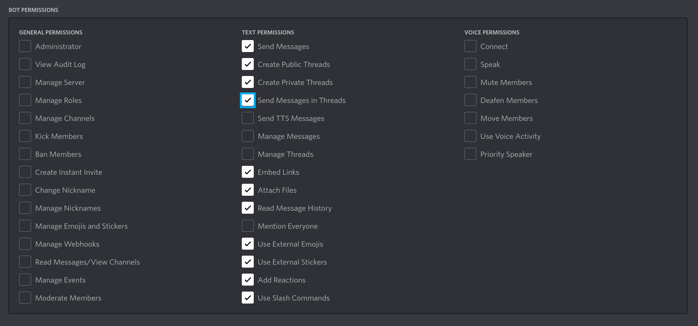

# Thingy

Discord bot to generate images based on a text prompt - way more than just that! Through a wide variety of tools, you can alter your generated images and share them with friends.

Integrates with DiscoArt, Stable Diffusion and other peculiarities, all rolled up in a single, sexy user interface that allows one to mix and match different configurations without a steeper learning curve!

- Powerful customization tools
- Fairness queue: Making sure everyone gets to make art!
- Social features: Sharing, profiles and stats
- Advanced Profile customization
- A massive upscaling feature with the ability to upscale up to 3k
- **Chapters**: Work on your pieces, and switch back to previous works of art!
  - Every "creation" command (`/stable_diffusion`, `/disco_diffusion`) results in a new chapter
  - Users can use variation commands (`/upscale`, `/variate`, ~~more to come~~) to alter said chapters as they wish
  - Don't like a change? Just do `/rollback`! There's unlimited undo!
  - Users can instantly swap back to previous chapters with `/chapters`
    
[Demo video + dev journey](https://www.youtube.com/watch?v=epLF0OXTp-A)

In short: this bot allows you to generate images based on a text prompt, but can do way more than just that - offering a wide variety of tools to make alter your generated images.

# Demo art

# Credits and special thanks

 - First and foremost Han Xiao for being around in DMs helping me with what I struggled with but also putting me on the right direction in various moments
 - [DiscoArt](https://github.com/jina-ai/discoart): without this project, I was never able to cook this up in a weekend
 - [Jina](https://jina.ai) which has some incredible tooling I got familiar with
 - [Mahdi Chaker](https://twitter.com/MahdiMC) for the heavy training GPUs for LEAP!

# Demo

[My discord server](https://discord.gg/j4wQYhhvVd) has the bot running, both alpha and production bots are up!

# Run it yourself!

As this bot is open-source, anyone can run it. Depending on the method, you need different specs. The easiest is through Docker and Jina's JCloud

## Installing via Docker

**Note!** As we evolved from a weekend project to a larger-scale bot, things have changed a lot, and I thank you all. Please, if you use this in your own server, do get in touch with me, so we can see what works and what doesn't. Any feedback is really appreciated! Feel free to join [Thingy's birthplace](https://discord.gg/j4wQYhhvVd) or shoot a line in the projects Issues page!

**What you need**:

 - Linux or Windows with Docker installed (Or [download here](https://docs.docker.com/get-docker/))
 - Discord account and bot (more on this later)

**Steps**:

 - Create a directory where we will set up our bot
    - If you ran an older version of the bot, you can drop your `db.sqlite` here. Keep in mind the configuration has changed slightly. Otherwise, you can ignore this.
 - Download [this file](https://raw.githubusercontent.com/peterwilli/Thingy/main/config.example.yml) and name it `config.yml`, put it into the bot directory. 
 - Once done, follow "Setting up the bot" and then go back here

 - **The following steps are for running the AI remotely on JCloud! (Free for now!)**

    - We need to start the Docker image:
    - 
      - If you're updating, make sure to run `docker pull peterwilli/thingy:latest` first, and back up your database! (We do some migration, and while it's tested, a backup is never a bad idea!)

      - If you're starting fresh, you can use the following command in the bot directory: `docker run -v $(pwd):/opt/thingy/data -d --name=thingy peterwilli/thingy:latest`

    - Once it is running, log in to JCloud by running: `docker exec -it thingy jc login`. You should now get a link that you can copy-paste in your browser to login.

    - Now you should be able to run `/stable_diffusion` and other peculiarities in Discord! The first time it might take a while to run.

## Setting up the bot

- Create a Discord application on their [developer portal](https://discord.com/developers/applications/me)
- Make a discord bot by clicking on the Bot menu, and click "Add Bot". Name it as you like
- Click "Reset Token" to reveal the bot token. Make note of this token, you need it in the next step
- In the config.yml, change the bot name and token to your bot token
- Go to [Hugginface Tokens](https://huggingface.co/settings/tokens) (make an account if you don't have one yet) and create a token
  - Replace `token_from_hf` in config.yml with the token you just created
  - This token allows you access to the Stable Diffusion model!
- Save the config
- Go to the OAuth2 menu, and click the URL Generator submenu. Check off the Bot checkbox
- In bot permissions, you only need the following:
    
- After you have done this, you can copy the link and invite the bot into your server
  - The first time, the bot may be triggering a timeout error, this is because it has to download all the model files. After it's done, it'll run properly
- You can now resume the previous steps (wherever you were forwarded from)

### How to enable the Share feature (optional)

- [Make sure Discord is in developer mode](https://www.howtogeek.com/714348/how-to-enable-or-disable-developer-mode-on-discord)
- Make a channel, any place you like (bot needs to be able to post to it, so make sure has write permissions there). Name it something like `gallery`
- Right-click on the channel and click "Copy ID"
- Paste the channel ID in `shareChannelID` in the bots `config.yml`. Restart bot if its running!
- Now you and your members can use `/share` for showcasing your fine art!

# Sister projects

These are co-developed with Thingy!

- [Keep My JCloud](https://github.com/peterwilli/KeepMyJCloud)
- [LEAP](https://github.com/peterwilli/sd-leap-booster)

# Changelog

 - 10 jan 2023: Added LEAP!
 - 01 dec 2022: Uploaded new Docker image for Thingy 3 + fixed sharing + fixed readme instructions
 - 26 sept 2022: Added Keep My JCloud as sister project, integrated in the bot using Docker. It keeps JCloud instances running by re-deploying if it dissapears.
 - 21 oct 2022: Fixes for hanging cache system + sister projects updates + faster SD! + Magic Prompts!